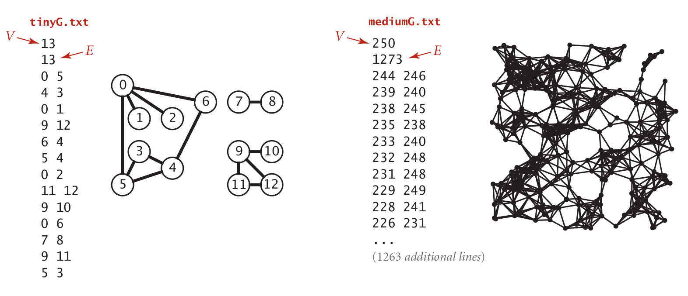
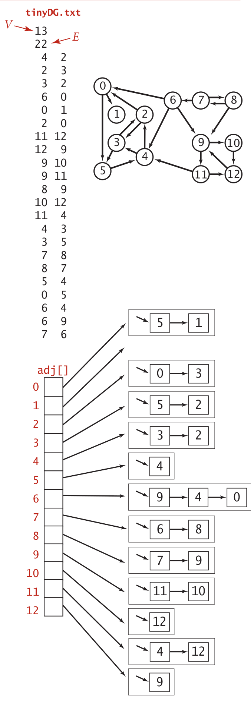

# Atividade 07

Nesta atividade, são fornecidos dois grafos não-orientados e dois dígrafos. Leia os arquivos e exiba as seguintes informações para cada tipo:

1. Grafos não-orientados (```tinyG.txt``` e ```mediumG.txt```):
   1. Leia um grafo e armazene por matriz de adjacências (aproveite o arquivo ```mainG.c```);
   1. Exiba os vértices de um percurso em profundidade (inicie outra busca caso ainda exista vértices não visitados);
   1. Exiba os vértices de um percurso em largura (inicie outra busca caso ainda exista vértices não visitados);
   1. Exiba o número de componentes conexas.
1. Grafos orientados (```tinyDG.txt``` e ```mediumDG.txt```):
   1. Leia um grafo e armazene por listas de adjacências (aproveite o arquivo ```mainDG.c```);
   1. Exiba os vértices de um percurso em profundidade (inicie outra busca caso ainda exista vértices não visitados);
   1. Exiba os vértices de um percurso em largura (inicie outra busca caso ainda exista vértices não visitados).

 




